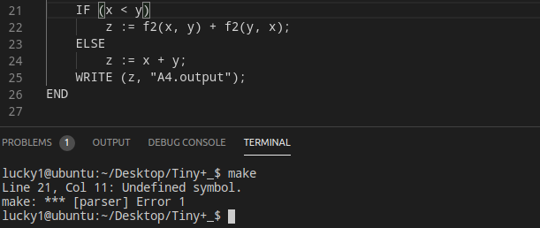
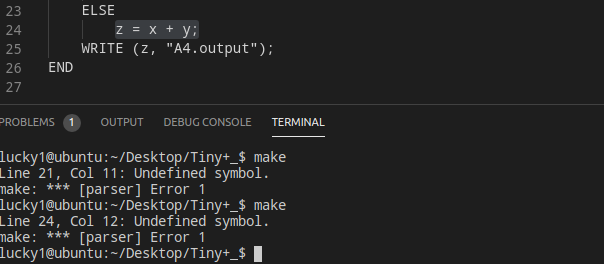
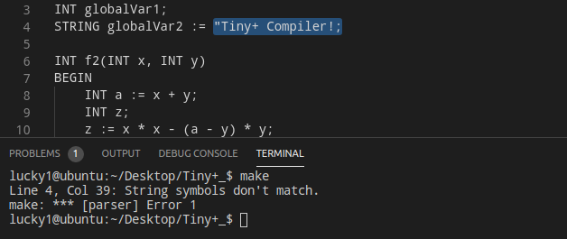
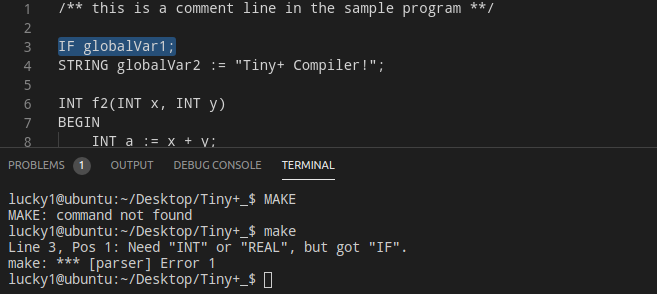
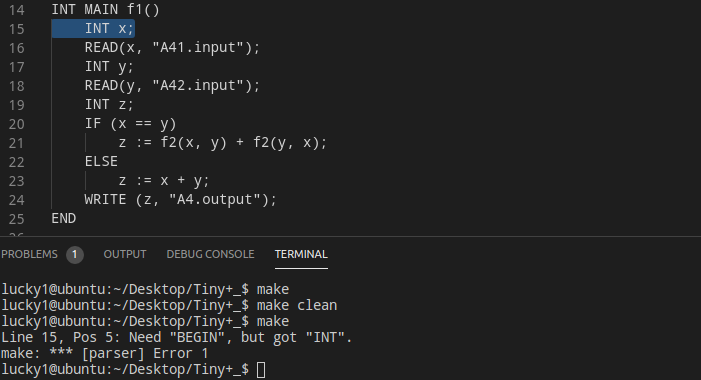

# Tiny+编译器实现　
相比于Tiny语言，我实现的`Tiny+`在原来的基础上新增加了全局变量`GlobalVarDecl`的声明，与局部变量`LocalVarDecl`的声明类似，如下：
```c++
LocalVarDecl -> Type Id ';' | Type AssignStmt
```  

```c++
GlobalVarDecl -> Type Id ';' | Type AssignStmt  
```  
不同的是，`LocalVarDecl`必须在方法声明（`MethodDecl`）中的函数块（`Ｂlock`）中：　　
```c++ 
MethodDecl -> Type [MAIN] Id '(' FormalParams ')' Block 　

Block -> BEGIN Statement+ END

Statement -> Block
           | LocalVarDecl  
           | AssignStmt   
           | ReturnStmt
           | IfStmt
           | WriteStmt
           | ReadStmt
```   
而`GlobalVarDecl`必须在`Block`外且在整个`Program`的开始，即：  

```c++
Program -> GlobalVarDecl* MethodDecl MethodDecl* 
GlobalVarDecl -> Type Id ';' | Type AssignStmt  
```  
 　
综上，新的` Tiny+　Language` 用`EBNF`语法表示如下：

### `The EBNF Grammar`  

`High-level program structures`  

```c++
Program -> GlobalVarDecl* MethodDecl MethodDecl* 
Type -> INT | REAL |STRING 
MethodDecl -> Type [MAIN] Id '(' FormalParams ')' Block
FormalParams -> [FormalParam ( ',' FormalParam )* ]
FormalParam -> Type Id
```  
`Statements`  
```c++
Block -> BEGIN Statement+ END
GlobalVarDecl -> Type Id ';' | Type AssignStmt
Statement -> Block
           | LocalVarDecl  
           | AssignStmt   
           | ReturnStmt
           | IfStmt
           | WriteStmt
           | ReadStmt
        
LocalVarDecl -> Type Id ';' | Type AssignStmt  

AssignStmt  -> Id := Expression ';'
           |  Id := QString ';'
ReturnStmt -> RETURN Expression ';'
IfStmt    -> IF '(' BoolExpression ')' Statement
            | IF '(' BoolExpression ')' Statement ELSE Statement
WriteStmt -> WRITE '(' Expression ',' QString ')' ';'
ReadStmt  -> READ '(' Id ',' QString ')' ';'
QString is any sequence of characters except double quote itself, enclosed in double quotes.  
```  
`Expressions`  
```c++
Expression -> MultiplicativeExpr  (( '+' | '-' ) MultiplicativeExpr)*
MultiplicativeExpr -> PrimaryExpr (( '*' | '/' ) PrimaryExpr)*
PrimaryExpr -> Num  // Integer or Real numbers
             | Id            
             | '(' Expression ')'
             | Id '(' ActualParams ')'
BoolExpression -> Expression '==' Expression 
                 |Expression '!=' Expression   
ActualParams -> [Expression ( ',' Expression)*]
```  
### `Sample program`  
```c++
/** this is a comment line in the sample program **/

INT v1;
STRING v2 := "1234";

INT f2(INT x, INT y)
BEGIN
    INT z;
    z := x * x - y * y;
    RETURN z; 
END

INT MAIN f1() 
BEGIN
    INT x;
    READ(x, "A41.input");
    INT y;
    READ(y, "A42.input");
    INT z;
    IF (x == y)
        z := f2(x, y) + f2(y, x);
    ELSE
        z := x + y;
    WRITE (z, "A4.output"); 

END
```
## `scanner`  
此部分为辅助程序`文件浏览器`，用于`按字符`读取tiny测试文件：包括`读取下一行`、`读取下一字符`以及`回退至上一字符`三个功能，为后面将`Tiny`语句转换为`Token`序列做准备  

`scanner`结构：`scanner`通过`row`和`column`来定位某个字符　　
```c
typedef struct scanner {
  FILE* file; //文件
  int row; //行数
  int column; //列数
} ScannerType;
```  
`nextLine`函数：读取下一行，即将`row`加1, `column`重新置0
```c
// 读取下一行。
void nextLine(ScannerType* scanner) {
  scanner->row++;
  scanner->column = 0;
}
```  

`nextChar`函数：读取下一字符，`column`加1,通过`fgetc`函数将位置标识符向前移动，并将该位置的`无符号char`强制转换为`int`返回
```c
// 读取下一字符。
int nextChar(ScannerType* scanner) {
  scanner->column++;
  return fgetc(scanner->file);
}
``` 
`lastChar`函数：回退至上一字符，`column`减1，通过`ungetc`函数将当前`char`放入文件中，变为下一个要读的字符
```c
// 回退至上一字符。
void lastChar(ScannerType* scanner, char ch) {
  scanner->column--;
  ungetc(ch, scanner->file);
}
```
## `token`  
此部分定义了`Tiny语句`的`token`关键字类型，以及与对应`Tiny`语句符号的匹配函数，用于做词法分析
`token`类型:其中`INT_LITERAL`,`REAL_LITERAL`,`STRING_LITERAL`分别表示`INT`、`REAL`、`STRING`的字面量，`EQ`为判等，`NE`为不等，`ASSIGN`为赋值，`IDENTIFIER`为标识符
```c
/* Tiny+ token type*/
typedef enum {
  /* special symbols */
  EQ = 256,NE,ASSIGN,IDENTIFIER,INT_LITERAL,REAL_LITERAL,STRING_LITERAL,
  
  /* keywords */
  INT,REAL,STRING,MAIN,BEGIN,END,IF,ELSE,READ,WRITE,RETURN
} TokenType;
```  
`matchKeyword`函数：匹配关键字，传入从文件中读取的`char*`，判断其是否为某个`关键字`，返回其`TokenType`（注意一一对应）
```c
/* Match keywords */
TokenType matchKeyword(const char* c) {
  for (int i = 0; i < sizeof(keywords) / sizeof(keywords[0]); ++i) {
    if (strcmp(c, keywords[i]) == 0) {
      return INT + i;
    }
  }
  return IDENTIFIER;
}
```
## `lexical` 
此部分为`Tiny`语法的`词法分析器`，即将`Tiny`语句转换为`Token`序列，并能根据`Token`序列做一些简单的`词法错误分析`，需要注意的几点如下：
- 字符`"/"`的分析：因为该字符单独出现为`运算符`，而如果后面跟`"*"`，就可能为`注释`，所以这里需要做两种判断：若为`运算符`，直接返回`"/"`即可，如可能为注释，则需要判断`注释的符号`是否前后匹配　　
- 因为`赋值运算符`被定义为`":="`，而并非`"="`，所以当遇到字符`"="`，如果下一字符不为`"="`，即组合成为`相等判别符`，则为词法错误，所以这里不用做另外的判断  
- 读取字符为`"`时，因为只有`字符串字面量`允许出现`"`，所以只需判断其后的字符集是否为`字符串`，同时检查末尾是否出现对应的`"`即可  

`Lex`数据结构:
```c
// 词法分析器。
typedef struct lex {
  ScannerType* scanner;	// 文件浏览器
  char c;	// 当前输入字符
  char buf[256];	// 缓冲区：用于存储字面量
  char* p;	// 缓冲区指针
  char* literal;	// 字面量字符串
  int start;	// 记录起始位置
} LexType;
```  
词法分析过程([源代码](https://github.com/luji17343080))：通过`Scanner`读取当前`char`：
   - 若为`空格`和`缩进`，则直接跳过
   - 若为`换行符`，则调用`Scanner`的`nextLine`函数跳到下一行
   - 若为`!`、`=`、`:`，则调用`Scanner`的`nextChar`函数判断下一字符是否为`=`，若是，则返回相应的`TokenType`；若不是，则打印词法错误：`"Undefined symbol."`  
   - 若为`;`、`(`、`)`、`+`、`-`、`*`、或者`,`，则直接返回字符  
   - 若为`/`，则根据前面`注意`的点中提到的判断其为`运算符`还是`注释`  
   - 若为`"`，读取后面的字符，判断是否符合`字符串的定义`  
   - 若为`数字`或者`字母`，则不断读取后面的字符，组成相应的`字面量`，储存到`缓冲区`中
## `parser`
此部分为`Tiny`的`语法分析器`，是在`词法分析`的基础上将`Token`序列组合成各类语法短语，包括`Program`、`Statements`、`Expressions`等（根据`EBNF`语法），并能做一些简单的`语法分析`，最终通过`ast`(抽象语法树)的形式打印到文件中，用`缩进数目`来抽象表示树的`父子关系`  

`parser`数据结构:
```c
// 语法分析器
typedef struct parser {
  FILE* output;	// 输出文件
  LexType* lex;	// 词法分析器
  TokenType token;	// 当前分析字符
  int indentCounts;	// 缩进的数目
}ParserType;
```  
词法分析过程([源代码](https://github.com/luji17343080))：通过`Lex`读取当前`Token`,再通过调用`词法分析器`中的`nextToken`函数将`Tiny+`程序转换为`Token`序列，再根据`EBNF语法用`，`递归下降`分析整个程序，需要分析的`语法结构`大致如下：    
```c
/* 根据 EBNF Grammar 对程序进行语法分析，构造语法树 */
void Program(ParserType* parser); //Tiny程序
void MethodDecl(ParserType* parser); //方法声明
void GlobalVarDecl(ParserType* parser); //全局变量声明
void Type(ParserType* parser); //类型
void Id(ParserType* parser); //名称
void FormalParams(ParserType* parser); //形参
void FormalParam(ParserType* parser); //具体形参
void Block(ParserType* parser); //函数块
void Statement(ParserType* parser); //语句
void LocalVarDecl(ParserType* parser); //局部变量
void AssignStmt(ParserType* parser); //赋值语句
void ReturnStmt(ParserType* parser); //Return语句
void IfStmt(ParserType* parser); //IF语句
void WriteStmt(ParserType* parser); //Write语句
void ReadStmt(ParserType* parser); //Read语句
void Expression(ParserType* parser); //表达式
void MultiplicativeExpr(ParserType* parser); //乘法表达式
void PrimaryExpr(ParserType* parser); //基本表达式
void ActualParams(ParserType* parser); //实际参数
void BoolExpression(ParserType* parser); //bool表达式
```  
错误处理函数`parser_error`:  
```c
// 打印语法分析错误
void parse_error(ParserType* parser, int n, ...) {
  fprintf(stderr, "Line %d, Pos %d: Need ", SCANNER->row, LEX->start);
  va_list ex;
  va_start(ex, n);
  for (int i = 0; i < n; ++i) {
    if (i) {
      fprintf(stderr, " or ");
    }
    fprintf(stderr, "\"%s\"", getToken(va_arg(ex, int)));
  }
  va_end(ex);
  fprintf(stderr, ", but got \"%s\".\n", getToken(TOKEN));
  exit(1);
}
```

例子程序的`抽象语法树`结果如下：　　
```
Program
	->GlobalVarDecl
		->Type
			->INT
		->Id
			->globalVar1
	->GlobalVarDecl
		->Type
			->STRING
		->AssignStmt
			->Id
				->globalVar2
			->:=
			->STRING_LITERAL
				->"Tiny+ Compiler!"
	->MethodDecl
		->Type
			->INT
		->Id
			->f2
		->formal_params
			->FormalParams
				->Type
					->INT
				->Id
					->x
			->FormalParams
				->Type
					->INT
				->Id
					->y
		->Block
			->Statement
				->LocalVarDecl
					->Type
						->INT
					->AssignStmt
						->Id
							->a
						->:=
						->Expression
							->MultiplicativeExpr
								->PrimaryExpr
									->Id
										->x
							->+
							->MultiplicativeExpr
								->PrimaryExpr
									->Id
										->y
			->Statement
				->LocalVarDecl
					->Type
						->INT
					->Id
						->z
			->Statement
				->AssignStmt
					->Id
						->z
					->:=
					->Expression
						->MultiplicativeExpr
							->PrimaryExpr
								->Id
									->x
							->*
							->PrimaryExpr
								->Id
									->x
						->-
						->MultiplicativeExpr
							->PrimaryExpr
								->Expression
									->MultiplicativeExpr
										->PrimaryExpr
											->Id
												->a
									->-
									->MultiplicativeExpr
										->PrimaryExpr
											->Id
												->y
							->*
							->PrimaryExpr
								->Id
									->y
			->Statement
				->ReturnStmt
					->Expression
						->MultiplicativeExpr
							->PrimaryExpr
								->Id
									->z
	->MethodDecl
		->Type
			->INT
		->MAIN
		->Id
			->f1
		->formal_params
		->Block
			->Statement
				->LocalVarDecl
					->Type
						->INT
					->Id
						->x
			->Statement
				->ReadStmt
					->Id
						->x
					->STRING_LITERAL
						->"A41.input"
			->Statement
				->LocalVarDecl
					->Type
						->INT
					->Id
						->y
			->Statement
				->ReadStmt
					->Id
						->y
					->STRING_LITERAL
						->"A42.input"
			->Statement
				->LocalVarDecl
					->Type
						->INT
					->Id
						->z
			->Statement
				->IfStmt
					->IF
						->BoolExpression
							->Expression
								->MultiplicativeExpr
									->PrimaryExpr
										->Id
											->x
							->==
							->Expression
								->MultiplicativeExpr
									->PrimaryExpr
										->Id
											->y
						->Statement
							->AssignStmt
								->Id
									->z
								->:=
								->Expression
									->MultiplicativeExpr
										->PrimaryExpr
											->Id
												->f2
											->ActualParams
												->Id
													->x
												->Expression
													->MultiplicativeExpr
														->PrimaryExpr
												->Expression
													->MultiplicativeExpr
														->PrimaryExpr
															->Id
																->y
									->+
									->MultiplicativeExpr
										->PrimaryExpr
											->Id
												->f2
											->ActualParams
												->Id
													->y
												->Expression
													->MultiplicativeExpr
														->PrimaryExpr
												->Expression
													->MultiplicativeExpr
														->PrimaryExpr
															->Id
																->x
					->ELSE
						->Statement
							->AssignStmt
								->Id
									->z
								->:=
								->Expression
									->MultiplicativeExpr
										->PrimaryExpr
											->Id
												->x
									->+
									->MultiplicativeExpr
										->PrimaryExpr
											->Id
												->y
			->Statement
				->WriteStmt
					->Expression
						->MultiplicativeExpr
							->PrimaryExpr
								->Id
									->z
					->STRING_LITERAL
						->"A4.output"

```  
## `词法错误处理`  
由于这次是简单实现，所以错误只是`逐条显示`
- 出现未定义字符(组)类型，如`"="`、`"<"`  
	  
	
	
- 字符串格式错误（`"`未匹配）  


## `语法错误处理`
- 正式程序（除`注释`）未由`Type`(`INT`、`STRING`、`REAL`)开始，即非`GlobalVarDecl`和`MethodDecl`  
  
- 方法块`Block`缺少`BEGIN`或者`END`  
  
## [源码地址](https://github.com/luji17343080)